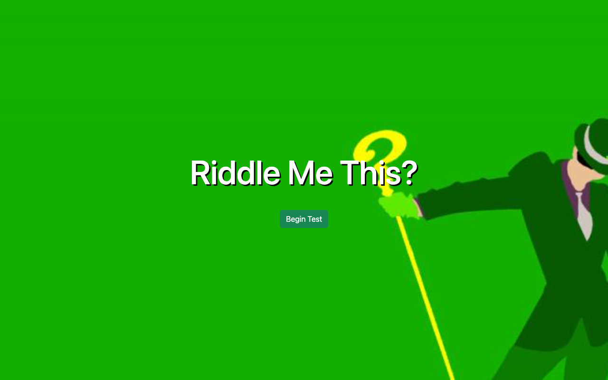
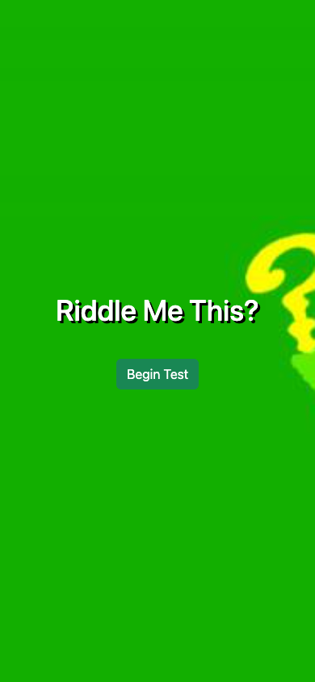
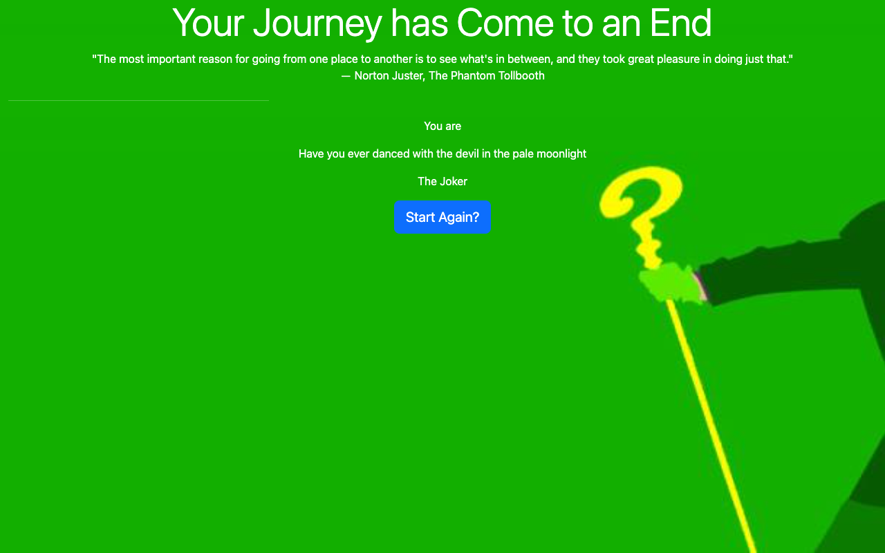

# Riddle Me This

A branching hero-or-villain personality quiz. Answer questions to discover one of six comic-book character outcomes, then replay to try another path.

## What you can do

- Start a quiz and follow the hero or villain question branch.
- See a result for Superman, Batman, Wonder Woman, Lex Luther, Joker, or Cheetah.
- Replay with a fresh score.

## Preview



Captured from the running application on September 30, 2026. Any sample records shown are demonstration or isolated test data, not data included with a fresh installation.

<details>
<summary>Mobile view</summary>



</details>

<details>
<summary>Quiz result</summary>



</details>

## Run locally

Use the Node version in `.nvmrc` (currently 26.10.0) and npm. Run these commands from the repository root.

```sh
nvm use  # if you manage Node with nvm
npm ci
npm start
```

Open [http://127.0.0.1:4200](http://127.0.0.1:4200). Keep the server in the foreground; stop it with **Ctrl+C**.

## Current scope

This is a local quiz with bundled backgrounds, no account, and no persistent history. A static production host must serve `index.html` for Angular routes.

## Development

```sh
npm run build
npm run typecheck
npm test -- --browsers=ChromeHeadless
```

Browser tests require Chrome or Chromium; set `CHROME_BIN` if it is outside the standard installation path. Angular 22 currently requires TypeScript 6.0.x. The Jasmine 6 test dependencies are retained for compatibility with Zone.js.
